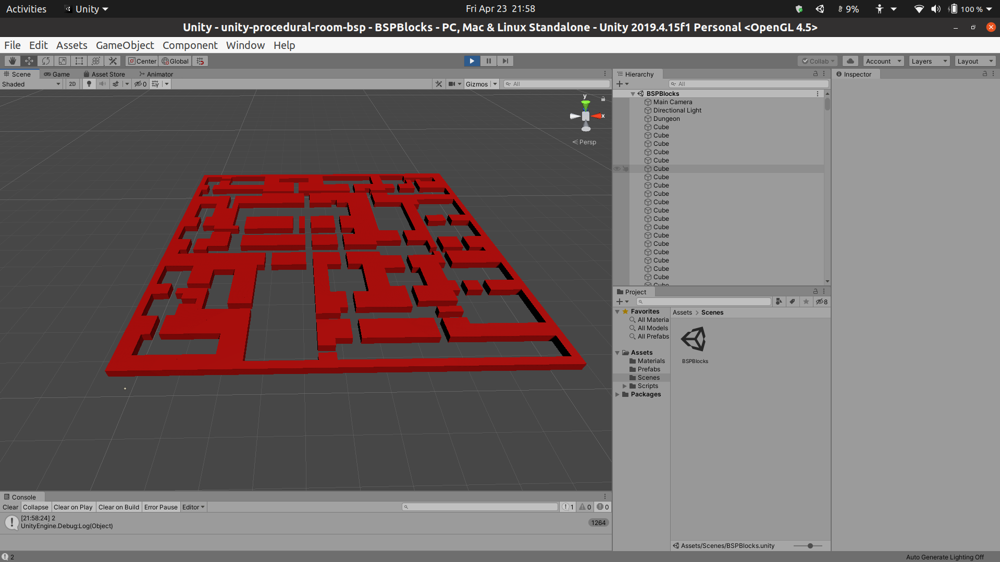
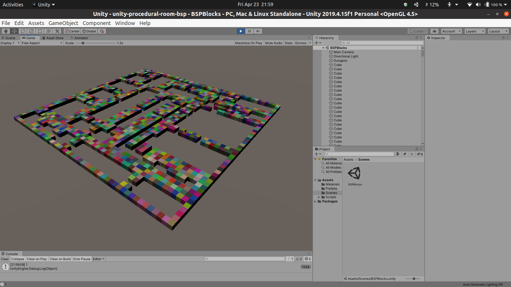

Procedural Indoor Room Layout Generation using BSP Tree
================

> Reference documentaion for the following instruction:
>   1. [Stackexchange answer](https://gamedev.stackexchange.com/a/82066)
>   2. [Random 2D dungeon][http://www.rombdn.com/blog/2018/01/12/random-dungeon-bsp-unity/]
>   3. Tutorial by [Holistic3d](https://www.youtube.com/channel/UCp_SOgsRYdLfIEWLjM62ZJg)

---

    

    

